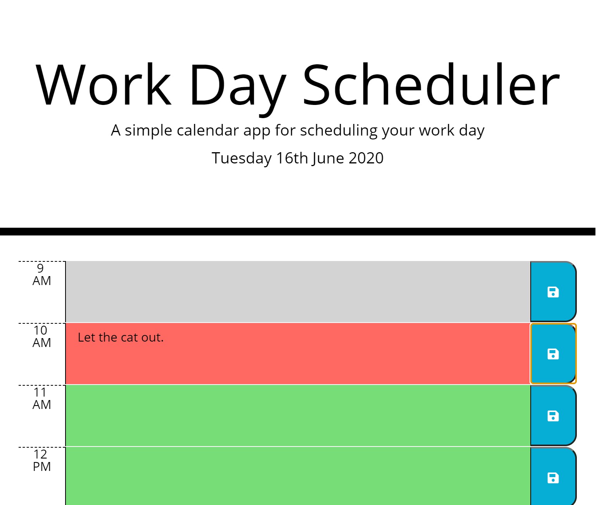
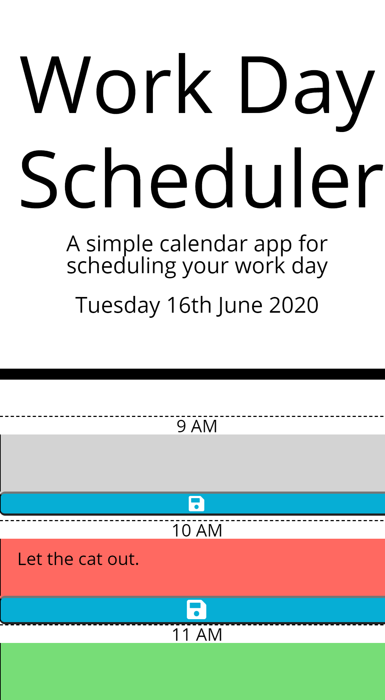

# Day Planner
## [Live site](https://andrew836-dev.github.io/dayPlan/)
## What is it?

This is a planner for a single day. There will be hour blocks for standard business hours, 9AM to 5PM. The hour blocks are given a color depending on if they represent a past, present or future hour. The current day and date is displayed at the top. Tasks and appointments can be added to the text boxes between the time and the blue button. Clicking the blue button will save that task to localStorage, meaning it will stay there if you refresh the page. 

### Technical details

This is the homework for week 5 of the bootcamp.
This page uses :-
* Bootstrap
* jQuery
* Moment.js
* Font Awesome 
* Google Fonts

The script.js file was written entirely by me, I also added the media query in style.css.

## Screenshot

